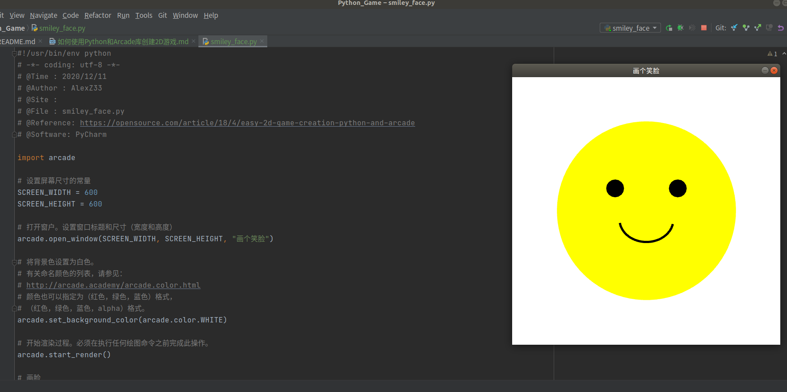
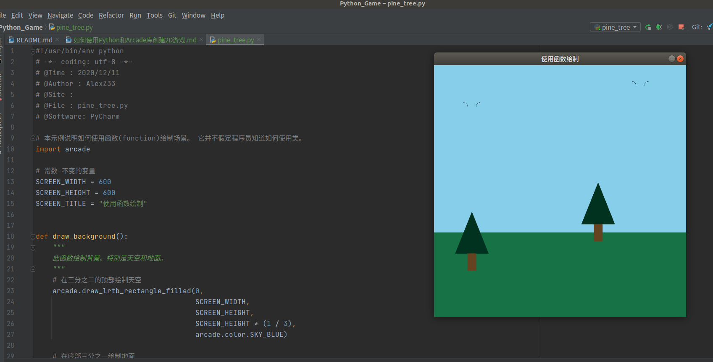

# 如何使用Python和Arcade库创建2D游戏
- 面向人群: 零基础或者初学者

- 难度: 简单， 属于Python基础课程

对于那些学习编程的人来说，Python是一种出色的语言，非常适合那些希望“完成工作”并且不花很多时间在样板代码上的人。 
`Arcade`是一个用于创建2D视频游戏的Python库，该库易于开始使用，并且在您获得经验时非常有能力。
在本文中，我将解释如何开始使用Python和Arcade对视频游戏进行编程。

# 重要说明
我们尽力保证课程内容的质量以及学习难度的合理性，但即使如此，真正决定课程效果的，还是你的每一次思考和实践。

课程多数题目的解决方案都不是唯一的，这和我们在实际工作中的情况也是一致的。因此，我们的要求功能的实现，更是要多去思考不同的解决方案，评估不同方案的优劣，然后使用在该场景下最优雅的方式去实现。所以，我们列出的参考资料未必是实现需求所必须的。有的时候，实现题目的要求很简单，甚至参考资料里就有，但是背后的思考和亲手去实践却是任务最关键的一部分。在学习这些资料时，要多思考，多提问，多质疑。相信通过和小伙伴们的交流，能让你的学习事半功倍。


# 1.1 任务介绍
- 1、简单绘制一个笑脸(示例一 smile_face.py)
- 2、画一棵松树（示例二 使用函数画一颗松树 spine_tree.py）
- 3. 
# 1.2 知识点
- Linux命令行的使用
- Python基础
- Arcade库的使用

# 1.3 环境
- linux系统(ubuntu18.04)/ windows系统可以打开ubuntu子系统
- pycharm编辑器(windows如何安装pycharm社区版本)
- Python 3.6.9(windows如何安装python环境)
- pip3 9.0.1
- arcade 2.5

```bash
$ python --version
Python 3.6.9

$ pip3 --version
pip 9.0.1 from /usr/lib/python3/dist-packages (python 3.6)
```
像许多其他软件包一样，可以通过[PyPi](https://pypi.org/)使用Arcade，这意味着您可以使用pip命令（或pipenv命令）安装Arcade。如果您已经安装了Python
## windows系统：

- （1）Win+R，输入cmd，打开Windows的命令行。
- （2）输入：pip install arcade，等待安装完成。 如果安装过程不顺利，请百度找到原因，直到安装成功为止

##  linux系统：

```bash
sudo pip3 install --upgrade pip
sudo pip3 install arcade
```
## MacOS系统
```bash
pip3 install arcade
```

有关更详细的安装说明，您可以参考[Arcade安装文档](https://arcade.academy/installation.html)。

# 1.4  代码

示例一 smile_face.py
```python
#!/usr/bin/env python
# -*- coding: utf-8 -*-
# @Time : 2020/12/11
# @Author : AlexZ33
# @Site : 
# @File : smiley_face.py
# @Reference: https://opensource.com/article/18/4/easy-2d-game-creation-python-and-arcade
# @Software: PyCharm

import arcade

# 设置屏幕尺寸的常量
SCREEN_WIDTH = 600
SCREEN_HEIGHT = 600

# 打开窗户。设置窗口标题和尺寸（宽度和高度）
arcade.open_window(SCREEN_WIDTH, SCREEN_HEIGHT, "画个笑脸")

# 将背景色设置为白色。
# 有关命名颜色的列表，请参见：
# http://arcade.academy/arcade.color.html
# 颜色也可以指定为（红色，绿色，蓝色）格式，
# （红色，绿色，蓝色，alpha）格式。
arcade.set_background_color(arcade.color.WHITE)

# 开始渲染过程。必须在执行任何绘图命令之前完成此操作。
arcade.start_render()

# 画脸
x = 300
y = 300
radius = 200
arcade.draw_circle_filled(x, y, radius, arcade.color.YELLOW)

# 画右眼
x = 370
y = 350
radius = 20
arcade.draw_circle_filled(x, y, radius, arcade.color.BLACK)

# 画左眼
x = 230
y = 350
radius = 20
arcade.draw_circle_filled(x, y, radius, arcade.color.BLACK)

# 画微笑
x = 300
y = 280
width = 120
height = 100
start_angle = 190
end_angle = 350
arcade.draw_arc_outline(x, y, width, height, arcade.color.BLACK, start_angle, end_angle, 10)

# 完成绘图并显示结果
arcade.finish_render()

# 使窗口保持打开状态，直到用户点击“关闭”按钮为止
arcade.run()
```



示例二 pine_tree.py

```python
#!/usr/bin/env python
# -*- coding: utf-8 -*-
# @Time : 2020/12/11
# @Author : AlexZ33
# @Site : 
# @File : pine_tree.py
# @Software: PyCharm

# 本示例说明如何使用函数(function)绘制场景。 它并不假定程序员知道如何使用类。
import arcade

# 常数-不变的变量
SCREEN_WIDTH = 600
SCREEN_HEIGHT = 600
SCREEN_TITLE = "使用函数绘制"


def draw_background():
    """
    此函数绘制背景。特别是天空和地面。
    """
    # 在三分之二的顶部绘制天空
    arcade.draw_lrtb_rectangle_filled(0,
                                      SCREEN_WIDTH,
                                      SCREEN_HEIGHT,
                                      SCREEN_HEIGHT * (1 / 3),
                                      arcade.color.SKY_BLUE)

    # 在底部三分之一绘制地面
    arcade.draw_lrtb_rectangle_filled(0,
                                      SCREEN_WIDTH,
                                      SCREEN_HEIGHT / 3,
                                      0,
                                      arcade.color.DARK_SPRING_GREEN)


def draw_bird(x, y):
    """
    用几条弧线画一只鸟。
    """
    arcade.draw_arc_outline(x, y, 20, 20, arcade.color.BLACK, 0, 90)
    arcade.draw_arc_outline(x + 40, y, 20, 20, arcade.color.BLACK, 90, 180)


def draw_pine_tree(x, y):
    """
    此函数在指定位置绘制一棵松树。
    """
    # 在顶部绘制三角形
    arcade.draw_triangle_filled(x + 40, y,
                                x, y - 100,
                                x + 80, y - 100,
                                arcade.color.DARK_GREEN)

    # 画行李箱
    arcade.draw_lrtb_rectangle_filled(x + 30, x + 50, y - 100, y - 140,
                                      arcade.color.DARK_BROWN)


def main():
    """
    这是主程序。
    """

    # 打开窗户
    arcade.open_window(SCREEN_WIDTH, SCREEN_HEIGHT, SCREEN_TITLE)

    # 开始渲染过程。必须在执行任何绘图命令之前完成此操作。
    arcade.start_render()

    # 调用我们的绘图函数。
    draw_background()
    draw_pine_tree(50, 250)
    draw_pine_tree(350, 320)
    draw_bird(70, 500)
    draw_bird(470, 550)

    # 完成渲染。
    # 没有这个，什么都不会画。
    # 必须在所有绘制命令之后使用
    arcade.finish_render()

    # 保持窗在，直到有人将其关闭。
    arcade.run()


if __name__ == "__main__":
    main()
```
　　

经验更丰富的程序员会知道，现代图形程序会先将图形信息加载到图形卡上，然后再要求图形卡批量绘制图形信息。 Arcade也支持这一点。 分别绘制10,000个矩形大约需要0.800秒。 批量提取它们只需不到0.001秒。
# 如何使用　类

程序通常从Window类派生，或使用装饰器。这使程序员可以编写代码来处理绘图，更新和处理来自用户的输入。下面是用于启动基于Windows类的程序的模板。

```python
mport arcade

SCREEN_WIDTH = 800
SCREEN_HEIGHT = 600


class MyGame(arcade.Window):
    """ Main application class. """

    def __init__(self, width, height):
        super().__init__(width, height)

        arcade.set_background_color(arcade.color.AMAZON)

    def setup(self):
        # Set up your game here
        pass

    def on_draw(self):
        """ Render the screen. """
        arcade.start_render()
        # Your drawing code goes here

    def update(self, delta_time):
        """ All the logic to move, and the game logic goes here. """
        pass


def main():
    game = MyGame(SCREEN_WIDTH, SCREEN_HEIGHT)
    game.setup()
    arcade.run()


if __name__ == "__main__":
    main()
```